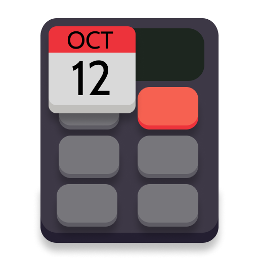

    
      

# Date Calculator
App for calculating anything related to dates

## Features
- Simple to use!
- Fast and responsive.
- Calculate differences between dates, with months, years, and weeks given.
- Find which day is a certain amount of dates away.
- Compatible with dynamic color themes.
- Open Source and ad-free.
    
## Installation
### Android
Check out `app-release.apk` over at the [GitHub Releases](https://github.com/WinsDominoes/dateapp/)
### Windows
Check out `dateapp-windows-x86_64-setup.exe ` over at the [GitHub Releases](https://github.com/WinsDominoes/dateapp/releases/) page. 
### MacOS
Check out `
dateapp-macos-universal.dmg` over at the [GitHub Releases](https://github.com/WinsDominoes/dateapp/releases/) page. 
### Linux

#### tar.gz
Check out `dateapp-linux-x64.tar.gz ` over at the [GitHub Releases](https://github.com/WinsDominoes/dateapp/releases/) page or `dateapp-linux-arm64.tar.gz` at the same place.

#### Flatpak
Check out Amy's [https://github.com/AtiusAmy/net.winscloud.DateCalculator](https://github.com/AtiusAmy/net.winscloud.DateCalculator) for Flatpak version.

### Web
Check out [https://datecalculator.winscloud.net](https://datecalculator.winscloud.net)

## Build
- Install [Flutter](https://docs.flutter.dev/get-started/install)
- Clone repository `git clone https://github.com/WinsDominoes/dateapp.git`
- Install required dependencies `flutter pub get`
- Run one of these commands for platforms
  
| Platform       | Command                 |
|----------------|-------------------------|
| Android        | `flutter build apk`     |
| Windows        | `flutter build windows` |
| Linux (x86_64) | `flutter build linux`   |
| MacOS          | `flutter build macos`   |

## Credits
- [WinsDominoes (Win)](https://github.com/WinsDominoes) - Developer
- [AtiusAmy (Amy)](https://github.com/AtiusAmy) - Research & Development / Quality Control
